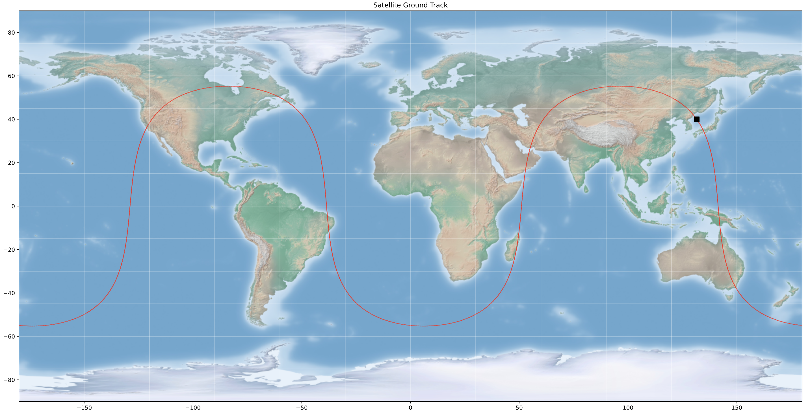

# Satellite SVN 63 (PRN 01) - Orbit computation
<a href="https://mapflap.github.io"></a>

## Overview

*This repository contains Python code to analyze the almanac of satellite SVN 63 (PRN 01) from the Block IIR constellation for the date 2016, 11, 28. The analysis includes computing clock offsets, satellite positions in both Orbital Reference System (ORS) and International Terrestrial Reference Frame (ITRF), converting coordinates to geodetic form, plotting clock offsets, satellite positions, groundtrack, and saving the results to a text file.*

## Author
[Bosso Francesco](https://github.com/FBosso) - (fra.bosso97@gmail.com)

## Problem statement
* Almanac Analysis for SVN 63 (PRN 01): 
	* Utilizing the almanac data for satellite SVN 63 (PRN 01) from the Block IIR constellation on November 28, 2016.
* Clock Offsets: 
	* Compute clock offsets for SVN 63 and plot the results.
* Satellite Positions in ORS and ITRF: 
	* Calculate the satellite positions in both Orbital Reference System (ORS) and International Terrestrial Reference Frame (ITRF) using X(t), Y(t), Z(t) coordinates.
* Groundtrack Plot:
	* Plot the groundtrack of satellite SVN 63.
* Results Output:
	* Print the computed clock offsets, satellite positions, and groundtrack to a text file.



## Dependencies
This project relies on the following libraries:

+ [python 3.9](https://python.org/): Needed for compatibility with basemap

```bash
$ conda create -name orbit_computation python=3.9
```

+ [numpy](https://numpy.org/): Used for array operations.

```bash
$ conda install -c conda-forge numpy
```

+ [matplotlib](https://matplotlib.org/): Used to plot the results

```bash
$ conda install -c conda-forge matplotlib
```

+ [pandas](https://pandas.pydata.org/): Used to handle datasets.

```bash
$ conda install -c conda-forge pandas
```

+ [basemap](https://matplotlib.org/basemap/): Used to plot the results on maps

```bash
$ conda install -c conda-forge basemap
```


## Usage
To run the project, make sure to install the required dependencies mentioned above. Then, execute the script "main.py"